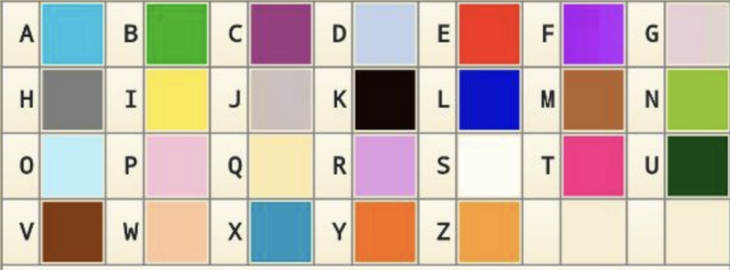

# коди для ролтві ґф

### Код автора   
  

### Код стенів
  

### Кольоровий код
  
(ця фігня видає ргб кольори, які ви можете вкинути в гугл щоб побачити)(внизу фото)

### Для кольорового коду при розшифровці вписуйте кожен код ргб через пробіл. розділові знаки також через пробіл.
**приклад:** 7C7E7D FE2917 0913CD 0913CD B7F0FB ,   FFC699 B7F0FB E39BE4 0913CD C2D2EB !

**Як запустити:**  
Натисніть на кнопку **"Open in Colab"**, щоб відкрити код у Google Colab. 

Ви побачите сирий код, зліва згори біля якого буде кнопка з трикутничком у кружечку. 
Тицяйте її і вона запустить код. Можливо, доведеться потикати дозволи або залогінитись в Гугл.
Почекайте, поки воно прогрузить. Знизу під кодом зʼявиться віконце для виконання команд.

Код примітивний, тож дотримуйтесь інструкцій:
Введіть через клавіатуру 0 для того, щоб розшифрувати код і натисніть ентер.
  Тоді вставте зашифрований текст і натисніть ентер.
  Вуаля, ваш результат.

АБО
Введіть через клавіатуру 1 для того, щоб зашифрувати код і натисніть ентер.
  Тоді напишіть текст англійською (капс необовʼязковий) і натисніть ентер.
  Вуаля, ваш результат.

**Зверніть увагу**
Шифр Стенів може розшифровувати не всі символи, але зашифровує всі. Я хз як це фіксити, мені лінь, я робили ці штуки на колінці за пів години
не засуджуйте за такий примітивний код я лінтяй

